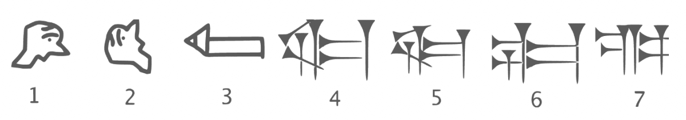
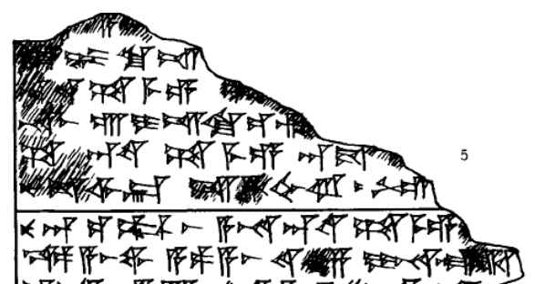

Cuneiform, the ancient orthography used by Near-Eastern civilizations
from 3500BC to the first century in the Common Era, is significant not only
because it represents mankind’s shift from pre-history to history- people
describing ideas in their language on their terms, but also because it gives us
great insight into the languages of the ancient Near East: Sumerian, Akkadian,
Elamite, Hittite. All of the information we have about the onset of human
civilization in the Near East has been facilitated by the fact that we were able to
phonetically analyze the scripts of these dead languages and draw conclusions
based on the way we know language works. This post will discuss how
Cuneiform transformed from its use as a seal and record-keeping tool by the
Sumerians, into a full written language, and how this script was then taken and
changed by surrounding civilizations in order to fit the phonetics and syntax of
their own languages.

Some historical context is important to frame Cuneiform and its
significance in the ancient Near East. With the onset of the Neolithic revolution
between 5000 BC and 3000BC, mankind was undergoing its most significant
transformation- the discovery of agriculture and the push to form larger settled
communities. No other region in the world could have been more suited to
creating this than the Near East, which had at the onset of this revolution had the
largest urban populations in the world. Sumer, on the borders of the Euphrates
River in what is modern day Iraq, had some of the world’s first cities, with the
largest, Uruk, having a population of somewhere between 50,000 and 80,000
people(a far cry from the bands of around 30 people that had populated the preneolithic era just centuries before). 

These urban populations represented mankind’s first experiment with large-scale interactions, and with these large
scale interactions came the need to keep records of some sort. 
From around 3500BC to 3200BC, the Sumerians represented these records
as pictures (usually of cattle or grain or other tangible items). This process is
paralleled, slightly later, in the blooming urban centers of the Nile Delta, and in
Northwest India with the seal inscriptions of the Harappans slightly thereafter.
These pictographs eventually transformed into the idea that these pictures
represented(ideographs). The evolution of the Cuneiform script from the seal and
record symbols to the Cuneiform as we know it today was a process that
happened relatively quickly(over a period of 500 years from 3500BC to 3100BC) . 
This transformation can be seen in the evolution of Sumerian “SAG” HEAD:

Sumerian, at the onset of this change from pictograms to ideograms,
would have been impossible to read(unless serious guesswork as to what all of
the original pictograms must have represented had taken place) had it not been
for the fact that some of these pictograms came to represent sounds in a
language, rather than ideas. Cuneiform built words with these two kinds of
characters- ideograms that evolved from related pictograms, and proper
phonetic symbols that came to represent the sound(or part of the sound) that the
pictogram represented. Thus, the word for “star” in Sumerian could either be
represented as: 𒀯, the ideogram, or phonetically as the symbols **MU** and **UL**, to
form the word **MUL**, 𒈬+𒌌, which is how the Sumerians would have
phonetically pronounced this word.

Sumerian, also used special characters that were not pronounced at all but
used to aid the scribe or the reader- determiners. Determiners, which are very
common in languages that are analytic, including Chinese, are placed next to
words in order to categorize. For example, the 𒁹 followed all male personal
names. 𒌷 is the symbol is put before(or sometimes after) the name of a city or a
large settlement, which is why the great capital of the Sumerians, Uruk, was
spelled out 𒌷𒀔, with the first symbol being unpronounced and the second
being an ideogram of the city. The Sumerians also did this for female names,
names of trees(and in fact, all things made out of wood), countries, people and
ethnicities. Though these were not pronounced in Sumerian, the other Cuneiform
scripts would fossilize these determiners as well. Sometimes, a determiner could
also be an ideogram, as in 𒀯, which discussed above as an ideogram, was also
the determinative placed right after the names of all stars.

The Sumerian Language recognized at least the following consonants: b,
d, g, g̃, ḫ, k, l, m, n, p, r, ř, s, š, t, z. They clearly made a distinction between
alveolar stops(t,d are distinct), alveolar and bilabial nasals(m and n are separate), 
as well as velar nasals as in g̃. In addition to the b,d,g,k,l,m,n,p,r,t,z, which are also
part of English phonology, Sumerian has velar fricatives, ḫ or x. It also has the
affricate /ř/ that was most likely produced as a voiceless aspirated alveolar
affricate. The vowels in the language are /a/, /e/, /i/, and /u(with /o being
discussed later as a possible vowel).

Excluding the Sumerian ideograms, the orthography of this syllabary was
very consistent, and obviously worked with the Sumerian phonetic
system(because they themselves made the written language). The syllables
followed the V or CV or VC form(**MU**+**UL**). There was no difference in Cuneiform
between voiced and unvoiced stops(b and p use the same symbol, for example).
Sumerian is an agglutinative language, created by stringing morphemes
with separable prefixes or suffixes (several of these could be chained onto the
root morpheme to make the meaning more complex). In addition, most words
were monosyllabic. With only 16 consonants and 4 vowels, there are at max 132
different combination for monosyllabic words(CV, VC, and V combined). It should,
then, come as no surprise that Sumerian has a vast number of homonyms, so
many in fact that most linguists are convinced that there must have been some
phonemic difference to separate these homonyms. For example, the language
may have been tonal, or perhaps had a pitch accent, or differ in length or have
some other sort of phonemic distinction; the issue is the writing leaves no clues
to what this difference may have been. Therefore, while Cuneiform may have
been a very good system for the monomorphemic and analytic language, it may
still be insufficient in describing all of the phonemic differences that may have
existed in the language, and in any case the speakers of Akkadian and Hittite
speak languages from families which notably lack any tone, so this would not
have been carried on after the death of Sumerian.

Continuing with the question ambiguity above, there also exist many
questions about the way Sumerian was pronounced that are up for debate. For
example, would MU+UL do what many languages naturally do and just assimilate
into MUL? Would MU+UL be pronounced slightly longer, or with a glottal stop,
as it might be pronounced in the Semitic Akkadian? As a language isolate, there’s
really no way to compare any documented language to Sumerian and construct
some sort of proto-language that could be used in aiding the phonologist. In
fact, for that matter, how do we know what any of the syllable-consonant clusters
sound like at all? How were these forms conjectured? If it seems as if making any
conclusions about Sumerian is superfluous and based on too much conjecture, 
that’s because it is; most of what we know about Sumerian in and of itself is not
enough to draw any conclusions about the way it was spoken or written.
The way we know anything about Sumerian at all- what the syllables map
to phonetically, the sounds likely common in the language, the "illegal"
sequences of the language- is because of another language that came to
dominate the region. 

It is due to this language that we have any information
about Sumerian, or for that matter Hittite, Elamite, or old Persian, at all.
The Akkadians, originally from parts of the Western Levant, eventually
settled north of Sumer on the banks of the Tigris and conquered the city states
around it, eventually even defeating Sumer around 2300BC and absorbing it into
its growing empire. Rather than ending the Sumerian language and orthography
completely, however, these new kings who would ironically ensure that
Cuneiform would long outlive the people who originally made it.
The Akkadians also had the task of using Sumerian Cuneiform to fit the
phonetics of their own language. This was not a simple task.

Akkadian, unlike Sumerian, is a Semitic language, and thus did not share a
lot of characteristics with Sumerian at all. Akkadian was not agglutinative, it did
not have the velar nasal or the voiceless aspirated alveolar affricate. It did on the
other hand have the q, ṣ, ṭ, emphatic stops, have phyringial affricates, and glottal
stops, none of which were part of Sumerian. As a Semitic language, it tended to
form triconsonental roots, without any regard to the vowels. Sumerian, on the
other hand, required both a vowel and a consonant in order to write the CV and
VC clusters. Many of its words were multisyllabic, while Sumerian was mainly
monosyllabic. An example of an Akkadian text below shows how the scribes
adapted this language isolate to fit their language. This text was taken from the
Amarna letters in classical Akkadian(EA-115-116). The cuneiform text was
analyzed to transliterate it into Akkadian, and then show the hypothetical reading
in Sumerian to illustrate differences in orthography. The bold letters indicate how
the text was pronounced, while the italics below indicate how the text would have
been pronounced in the Sumerian script. The **LUGAL** represents a borrowed
Sumerian ideograph.

116:031 yu-wa- ṣi-ru-na **LUGAL**-ru u
116:031 (n/a)-(n/a) zi-ru-na **LUGAL** ru u
116:032 ia-aq-bi **LUGAL**-ru a-na a-ṣu-nu
116:032 ia-ak-bi **LUGAL**-ru a-na a-zu-nu
116:032 LÚ $a-a[ y]u-ba-lu ṭup-pí-ia
116:032 LÚ $a-a[ y]u-ba-lu dup-pí-ia

Analyzing these difference between the (same) Cuneiform script reveals that the
the emphatic **ṣi** is realized as a **zi**, and the emphatic **ṭu** as a **du**.
The Sumerian language had a huge influence on Akkadian; there is
evidence of massive lexical, syntactical, and phonological borrowing during this
time. The Sumero-Akkadian Sprachbund was unique in that it was not only lexical
items that were shared and borrowed, but also syntax: the VSO order of Akkadian
came about because of influence from Sumerian. Sumerian remained the
language of religion and culture, much as Greek did in the Roman world, and so
Akkadians continued writing Sumerian, mainly in religious services, hundreds of
years after the language had ceased to be functional.

The fact that Sumerian was seen as a language of religion created a
fascinating phenomenon in Akkadian: Sumerograms. Akkadian did not only
borrow ideograms from Sumerian, but also the words that were spelled out
phonetically in Sumerian(like the word for star 𒈬𒌌) and kept that way in
Akkadian as a sign of respect for the Sumerian language itself . These words
would become ideograms in the unrelated Akkadian language. So if an Akkadian
saw the word 𒈬𒌌they would read the Sumerian “MUL” but pronounce it in
their own language, “KA-KA-BU”(star). In essence, thousands of combinations of
Sumerian words became ideograms in their own right. This idea would later be
extended even further to include Akkadograms- phonetic spellings of words in
Akkadian- that become ideograms in Hittite.

In Akkadian, the choice of writing words phonetically, using borrowed
ideograms, or using Sumerograms seemed to be mainly stylistic, and the words
themselves were understood to be equivalent. Logography seems to be more
prevalent in certain contexts, like legal documentation. Akkadian played a key role in deciphering Sumerian. Akkadian, unlike Sumerian, is very closely related to the living Semitic languages.

Cuneiform’s ability to be used for different language families did not end
with its extension to Semitic language. The first evidence we have of any IndoEuropean language in writing also came to us in the form of cuneiform. The
Hittites who called themselves the Neshli, spoke an Indo-European language from a
now extinct branch of IE called the Anatolian languages. They thrived in Hattusa,
the region which is today in northern Turkish Anatolia, and learned how to use
cuneiform not through conquest like their Assyrian counterparts thousands of
years earlier, but rather through cultural diffusion around 1300BC, over a
thousand years after Sumerian had given way to Akkadian.

Hittite phonology contained key differences to both Akkadian and
Sumerian. While Akkadian had the three-consonant clusters of vowels that were
then used to build sentences, and Sumerian was mostly monomorphemic, Hittite
was a less analytic and more synthetic language, which, like many other IndoEuropean languages, had many case endings and markers that were not as free
as they would be in an analytic language like Sumerian. The Hittite language had
the following sounds in its phonology: b, d, g, ḫ, k, l, m, n, p, r, š, t, z. However,
like Sumerian, there is no difference between voiced and unvoiced stops, leading
to some ambiguities in the writing. However, because of what we know about PIE
and its descendants, we can be certain that, like Sumerian , Hittite in fact did
distinguish between these two.

Still, the practice of writing Cuneiform seemed to be so standardized that
even by this point in time, the orthography had changed very little, with the
exception of the Sumerograms and the Akkadograms that had come over from
Mesopotamia. Where Akkadian sometime failed to resolve ambiguity about
Sumerian, Hittite became vital, as no other language family had been so
extensively researched and documented as the Indo European languages.
Below is the Hittite rendition of the Sumerian epic, “Gilgamesh”
**KBo 6.1 "Gilgamesh: First panel of the Hittite version**

1. a
2. uk? ki iš
3. ša me e
4. na aš úI iš ki iz
5. ša an **[Sumerogram]**
ša me e an da
6. ši ka ar iš ??ah ru ga
7. nu an **[Sumerogram]** aš a mu na **[Sumerogram]** ša me e
8. ka a aš ua(wa?) a pa a aš ??? za la **[Sumerogram]**
9. ku-it **[Sumerogram]**
ri [**Sumerogram]** pa a še ša nu-ut

Hittite is fascinating because of the way it take Sumerian and Akkadian
words and grammar and applies it to a totally different language family. For
example, Akkadian liked to use small separable prepositions(in, under, for) and
actually had more (positional) prepositions than any of its Semitic descendants.
The word **LUGAL** in Sumerian meant “king", and this word was borrowed,
phonetically and lexically, into Akkadian. So the phrase “**ANA** **LUGAL**” meant “For
the King”. Strange things happened when this phrase was eventually used in
Hittite. Hittite, as previously stated, is full of case endings: -s, -e, -n, -as, -i, -az, -
anza, -a, and -it. These case endings were very important semantically. The word
for King in Hittite is hassu and attached to the end of this word is the dative case
used to indicate for. While the phrase may have been pronounced hassu-i,, it was
spelled first with the Akkadian preposition **ANA**, followed by the Sumerian
ideogram **LUGAL**, followed by the **-I** in phonetic cuneiform. **ANA** **LUGAL** and
**HASSU-I** could hardly be more phonetically different, and represent the vast differences
between the three language familie In some ways the
respect and care these cultures took to preserve the “correct” form of spelling for
languages that died out hundreds, and in the case of Sumerian, thousands of
years prior, represents a cultural exchange of languages, ideas, and convention
over millennia in the Near East.

So Cuneiform, once only used to write a language isolate on the lower
Euphrates, eventually long outlived its last speakers, surviving from 3000BC until
2000BC. Akkadian, which had borrowed so much from Sumerian, nevertheless
used Cuneiform to varying degrees of success for the very different Semitic
Akkadian language. The orthography of Sumerian, once one-to-one(except for 
the fact that it didn’t differentiate between voiced and voiceless stops) no longer
followed the phonemic principle in a Semitic language that cared little about the
vowels that the monomorphemic Sumerian found so important. Sumerian
fossilized as a religious language, but was nonetheless revered and admired long
after its death. Hittite, millennia later, borrowed language through the lens of the
Akkadians, and unlike the Akkadians, started adding symbols in order to fit their
vocabulary. The Hittites, who existed around 1600BC to 1300BC, changed
Cuneiform to fit their own grammar while still keeping lexical, and even
grammatical elements that exist as a sort of vestigial feature of the language.
That Cuneiform could exist throughout millennia speaks to the respect and
admiration, as well as the malleability, Cuneiform held in the region.

**Works Cited:**
E. Rieken et al. (Ed.), hethiter.net /: CTH 341.III.1 (INTR 2009-08-12)
KBo 6.1 "Gilgamesh: First panel of the Hittite version"
Hethitisches Zeichenlexikon(unfortunately, this site was down when I tried to access it)
Pearce, Kristin M. (2010) "The Adaption of Akkadian into Cuneiform," Colonial Academic Alliance Undergraduate Research
Journal: Vol. 1, Article 2.
Cooper, Jerrold S. 1996. “Sumerian and Akkadian.” In The World’s Writing Systems, ed. Peter T. Daniels and William Bright,
37-58.
Oxford: Oxford University Press.1999. “Sumerian and Semitic Writing in Most Ancient Syro-Mesopotamia” in
Languages and Cultures in Contact, ed. K. Van Lerberghe and G. Voet, 61-77. Leuven: Peeters, 2004.
“The Origin of the Cuneiform Writing System.” In The First Writing: Script Invention as History and Process, ed. Stephen
Houston, 71-99. Cambridge: Cambridge University Press. 61 Ibid, 68. 62 Andrew George.
“Babylonian and Assyrian: A History of Akkadian,” in Languages of Iraq, Ancient and Modern, ed. J. N. Postgate, 31-71.
London: British School of Archaeology in Iraq, 2007.
Akkadian transcriptions from the Amarna Tablets transcripton from the humanities department at Tel-Aviv University,
Israel (http://www.tau.ac.il/humanities/semitic/EA115-162.html)
ANA LUGAL(-i) as "for the king" in Hittite Cuneiform is from page 29 of Theo van den Hout’s _The Elements of Hittite_.
For “hassus" as the Hittite reading of LUGAL, see the lemma "hassu-" on pages 240-241 of Jaan Puhvel’s _Hittite
Etymological Dictionary: Vol 3_.
Forms for Akkadian "mu-ul" and "ka-ka-bu" are given in H. Hunger’s _Astrological Reports to Assyrian Kings_ (1992)
