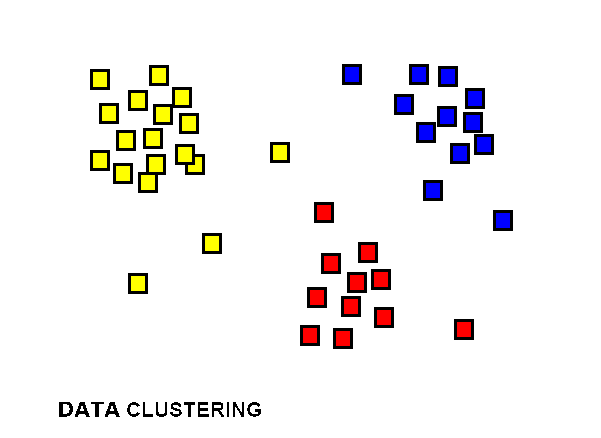
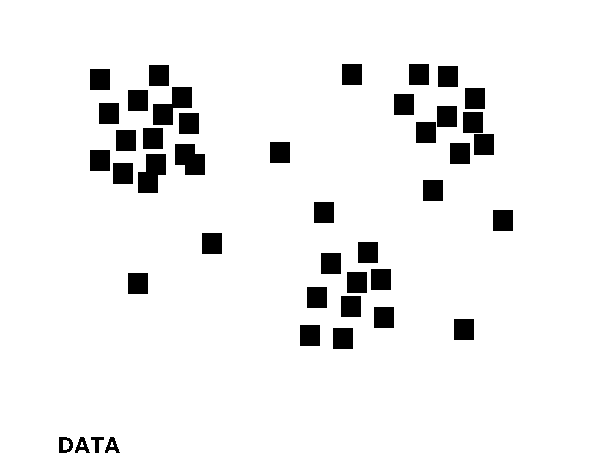

A good guide for inexperienced users must conform to basic pragmatic rules. Pragmatics is a subfield of linguistics that evaluates how human language is utilized in social interactions.[^1]One prevalent theory in pragmatics is _Relevance Theory_. 

### Relevance Theory [^2]:
All utterances of language must be:

 > relevant enough for it to be **worth the addressee's effort to process it**. (If the utterance contained too
 few positive cognitive effects for the addressee in relation to the processing effort needed to achieve
 these effects, she wouldn't bother processing it, and the communicator needn't have taken the trouble to
 utter it.)
 
 
 > the most relevant one compatible with the **communicator's abilities and preferences**. (Otherwise the
 communicator would have chosen a more relevant utterance – e.g. one that needs less processing effort
 and/or achieves more positive cognitive effects on part of the addressee – to convey her meaning. After
 all, she wants to be understood as easily and reliably as possible.)
 
 
These two rules are all a good communicator needs to remember when writing technical guides. You must
evaluate the lowest level of experience for your audience, and not the average level of experience, and
build all documentation from there. Examples of using these principles in documentation include:
- **Citing goals** and **Stating required experience levels** at the beginning of a document
- Allowing hyperlinks to link to more advanced articles, but ensuring the document is **functionally complete without them**
- Poviding an **example project or code sample** that utilizes advanced features, or at the very least a combination of the simple features a library or function provides
- Providing links to a website containing updates including **changelogs** and **bugfixes**

Finally, make sure that you have diagrams to illustrate more complicated concepts. Make sure that each diagram only represents one core concept, or they will quickly get cluttered.

|{:height="36px" width="36px"}| |

[^1]: Mey, J.L. (2006). "Pragmatics: Overview". Encyclopedia of Language & Linguistics. pp. 51–62
[^2]:Wilson, Deirdre; Sperber, Dan (2002). "Relevance Theory"
